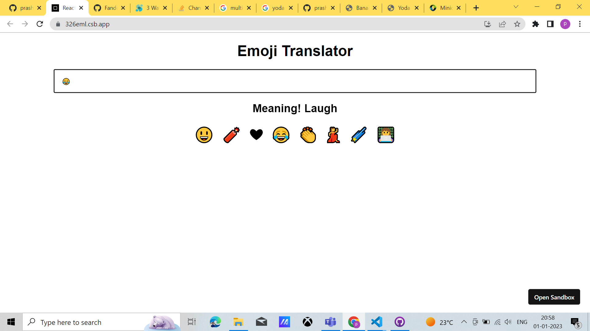

# Emoji-translator

## About
This app will help you finding the meaning of the emoji you click or you enter ,
beacuse sometime you might not understand the emoji.

## Tech stack

1. Javascript
1. CSS
1. HTML
1. React.js

## Hosting URL :

1. https://326eml.csb.app/

## Screenshots

## Future Roadmap

1. Soon i will update about the features and enhancement of application.

## About Author

Hi I am Prashant Gehlot
